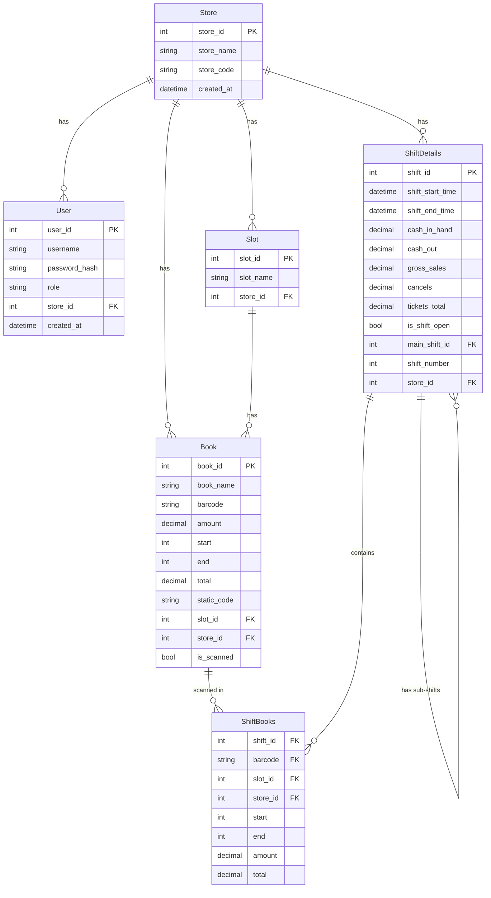

# Entity Relationship Diagram — LottoMeter v2.0

This document defines the database schema for LottoMeter v2.0, translated from the original C# Entity Framework Core models to SQLAlchemy.

> **v2.0 Note:** `store_id` and `role` have been added to the schema now to protect future multi-tenancy and role-based access without requiring a painful migration later. In v2.0 only one store and one role (employee) will be active — but the columns are in place.

---

## ERD

---

## Relationships Explained

| Relationship | Type | Description |
|---|---|---|
| Store → User | One-to-Many | Each user belongs to one store. |
| Store → Slot | One-to-Many | Each slot belongs to one store. |
| Store → Book | One-to-Many | Each book belongs to one store. |
| Store → ShiftDetails | One-to-Many | Each shift belongs to one store. |
| Slot → Book | One-to-Many | One slot holds many books. Each book belongs to exactly one slot. |
| Book → ShiftBooks | One-to-Many | A book can appear in many shift scan records across different shifts. |
| ShiftDetails → ShiftBooks | One-to-Many | A shift contains many scanned book records. |
| ShiftDetails → ShiftDetails | Self-referencing One-to-Many | A main shift can have multiple sub-shifts via `main_shift_id`. If `main_shift_id` is NULL it is a main shift. |

---

## Key Design Decisions

**store_id on every table** — added now to support multi-tenancy in the future. In v2.0 only one store exists, but every query will filter by `store_id` so the pattern is established from day one. This avoids a costly migration later.

**User.role** — a string column with values `employee` or `admin`. In v2.0 only `employee` is active. The `admin` role unlocks the manager dashboard in v2.1.

**ShiftBooks composite key** — `shift_id + barcode` together form the primary key. This enforces that the same book cannot be scanned twice within the same shift.

**Book.static_code** — extracted from the scanned barcode at scan time, used to match the barcode to the correct book record. This mirrors the logic from LottoMeter v1.

**Book.total** — computed as `(end - start) * amount`. Stored in the database for reporting purposes.

**ShiftDetails.main_shift_id** — NULL means this is a main shift. A non-NULL value links this record as a sub-shift under its parent.

---

## SQLAlchemy Model Summary

| Model | Table Name | Primary Key |
|---|---|---|
| Store | stores | store_id |
| User | users | user_id |
| Slot | slots | slot_id |
| Book | books | book_id |
| ShiftDetails | shift_details | shift_id |
| ShiftBooks | shift_books | (shift_id, barcode) — composite |

---

## User Roles

| Role | v2.0 | v2.1+ |
|---|---|---|
| `employee` | ✅ Active | ✅ Active |
| `admin` | ⏳ Column exists, not enforced | ✅ Active — unlocks manager dashboard |

---

*Phase 3 — System Design | LottoMeter v2.0*
