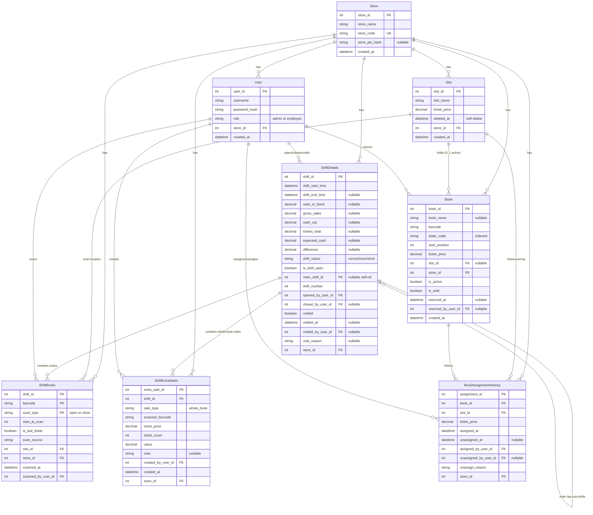

# Entity Relationship Diagram — LottoMeter v2.0

**Version:** 2.1
**Date:** April 2026
**Status:** Final — aligned with SRS v5.2

---

## Overview

LottoMeter v2.0 uses 8 models. Every non-Store table carries `store_id` for multi-tenancy. `ShiftDetails` is self-referential (main shift ↔ sub-shifts).

---

## Diagram



---

## Tables

### 1. Store
Root tenant entity.

| Column | Type | Constraints | Notes |
|---|---|---|---|
| store_id | Integer | PK, autoincrement | |
| store_name | String(150) | Not Null | |
| store_code | String(50) | Unique, Not Null | Human-readable identifier |
| store_pin_hash | String(256) | Nullable | bcrypt hash of 4-digit PIN; set at setup |
| created_at | DateTime | Not Null, default now() | UTC |

### 2. User

| Column | Type | Constraints | Notes |
|---|---|---|---|
| user_id | Integer | PK, autoincrement | |
| username | String(100) | Not Null | |
| password_hash | String(256) | Not Null | bcrypt |
| role | String(50) | Not Null, default 'employee' | `admin` or `employee` |
| store_id | Integer | FK → Store, Not Null, Indexed | |
| created_at | DateTime | Not Null, default now() | |

**Composite unique:** `(store_id, username)`

### 3. Slot

| Column | Type | Constraints | Notes |
|---|---|---|---|
| slot_id | Integer | PK, autoincrement | |
| slot_name | String(100) | Not Null | |
| ticket_price | Numeric(10,2) | Not Null | Must be in LENGTH_BY_PRICE keys |
| deleted_at | DateTime | Nullable | Soft-delete timestamp |
| store_id | Integer | FK → Store, Not Null, Indexed | |
| created_at | DateTime | Not Null, default now() | |

**Partial unique index** (SQLite 3.8+ / PostgreSQL):
```sql
CREATE UNIQUE INDEX uq_slots_store_name_active
  ON slots (store_id, slot_name)
  WHERE deleted_at IS NULL;
```

**Check:** `ticket_price IN (1.00, 2.00, 3.00, 5.00, 10.00, 20.00)`

### 4. Book

| Column | Type | Constraints | Notes |
|---|---|---|---|
| book_id | Integer | PK, autoincrement | |
| book_name | String(150) | Nullable | Optional admin label |
| barcode | String(100) | Not Null | Scanned barcode at most recent assignment |
| static_code | String(100) | Nullable until assignment, Indexed | Barcode minus last 3 digits |
| start_position | Integer | Nullable until assignment | Position at time of assignment |
| ticket_price | Numeric(10,2) | Nullable until assignment | Inherited from slot |
| slot_id | Integer | FK → Slot, Nullable | Null when unassigned or sold/returned |
| store_id | Integer | FK → Store, Not Null, Indexed | |
| is_active | Boolean | Not Null, default False | True when in a slot |
| is_sold | Boolean | Not Null, default False | True when last ticket scanned |
| returned_at | DateTime | Nullable | Set when book returned to vendor |
| returned_by_user_id | Integer | FK → User, Nullable | Who authorized the return |
| created_at | DateTime | Not Null, default now() | |

**Composite unique:** `(store_id, barcode)`, `(store_id, static_code)` — both NULL-tolerant
(In PostgreSQL and SQLite, UNIQUE allows multiple NULL values by default.)

**Check:** `ticket_price IS NULL OR ticket_price IN (1.00, 2.00, 3.00, 5.00, 10.00, 20.00)`

**State invariants:**
- If `is_active = true` then `slot_id IS NOT NULL` and `is_sold = false` and `returned_at IS NULL`
- If `is_sold = true` then `slot_id IS NULL` and `is_active = false`
- If `returned_at IS NOT NULL` then `slot_id IS NULL` and `is_active = false`

### 5. BookAssignmentHistory

Records every assignment, reassignment, and unassignment event.

| Column | Type | Constraints | Notes |
|---|---|---|---|
| assignment_id | Integer | PK, autoincrement | |
| book_id | Integer | FK → Book, Not Null, Indexed | |
| slot_id | Integer | FK → Slot, Not Null | Slot at time of this assignment |
| ticket_price | Numeric(10,2) | Not Null | Snapshot |
| assigned_at | DateTime | Not Null, default now() | |
| unassigned_at | DateTime | Nullable | Set when book leaves this slot |
| assigned_by_user_id | Integer | FK → User, Not Null | Admin who did it |
| unassigned_by_user_id | Integer | FK → User, Nullable | Whoever caused the unassign |
| unassign_reason | String(50) | Nullable | `reassigned` \| `unassigned` \| `sold` \| `returned_to_vendor` |
| store_id | Integer | FK → Store, Not Null, Indexed | |

**Index:** `(book_id, unassigned_at)` — speeds up "current assignment" lookups

### 6. ShiftDetails

Represents both main shifts and sub-shifts. Sub-shift is any row where `main_shift_id IS NOT NULL`.

| Column | Type | Constraints | Notes |
|---|---|---|---|
| shift_id | Integer | PK, autoincrement | |
| shift_start_time | DateTime | Not Null | |
| shift_end_time | DateTime | Nullable | Set when shift closes |
| cash_in_hand | Numeric(10,2) | Nullable | Only on sub-shifts, at close |
| gross_sales | Numeric(10,2) | Nullable | Only on sub-shifts, at close |
| cash_out | Numeric(10,2) | Nullable | Only on sub-shifts, at close |
| tickets_total | Numeric(10,2) | Nullable | Auto-calculated at close |
| expected_cash | Numeric(10,2) | Nullable | gross_sales + tickets_total - cash_out |
| difference | Numeric(10,2) | Nullable | cash_in_hand - expected_cash |
| shift_status | String(20) | Nullable | correct / over / short |
| is_shift_open | Boolean | Not Null, default True | |
| main_shift_id | Integer | FK → ShiftDetails(shift_id), Nullable | Null = main shift |
| shift_number | Integer | Not Null, default 1 | Sub-shift sequence within main |
| opened_by_user_id | Integer | FK → User, Not Null | |
| closed_by_user_id | Integer | FK → User, Nullable | |
| voided | Boolean | Not Null, default False | |
| voided_at | DateTime | Nullable | |
| voided_by_user_id | Integer | FK → User, Nullable | |
| void_reason | String(500) | Nullable | |
| store_id | Integer | FK → Store, Not Null, Indexed | |

**Partial unique index** (enforces FR-SHIFT-02):
```sql
CREATE UNIQUE INDEX uq_one_open_main_shift_per_store
  ON shift_details (store_id)
  WHERE main_shift_id IS NULL AND is_shift_open = TRUE;
```

**Composite unique:** `(main_shift_id, shift_number)` — sub-shift numbers unique within a main shift

**Check constraints:**
- `main_shift_id IS NULL OR main_shift_id != shift_id` — no self-reference loop
- `NOT voided OR void_reason IS NOT NULL` — void requires reason

### 7. ShiftBooks

Scan records. Composite PK keys on `static_code` (book identity) so open and close scans for the same book pair correctly even though their full barcodes differ by position.

| Column | Type | Constraints | Notes |
|---|---|---|---|
| shift_id | Integer | PK, FK → ShiftDetails | Always a sub-shift |
| static_code | String(100) | PK | Book identifier (barcode minus last 3 digits) |
| scan_type | String(10) | PK | `open` \| `close` |
| barcode | String(100) | Not Null | Full barcode string at scan time (audit) |
| start_at_scan | Integer | Not Null | Position extracted from barcode |
| is_last_ticket | Boolean | Not Null, default False | True only when scan_type=close AND close > open AND position is last |
| scan_source | String(25) | Not Null, default 'scanned' | `scanned` \| `carried_forward` \| `whole_book_sale` \| `returned_to_vendor` |
| slot_id | Integer | FK → Slot, Not Null | Slot at scan time (denormalized for reports) |
| store_id | Integer | FK → Store, Not Null, Indexed | |
| scanned_at | DateTime | Not Null, default now() | |
| scanned_by_user_id | Integer | FK → User, Not Null | |

**PK:** Composite `(shift_id, static_code, scan_type)`

**Check constraints:**
- `scan_type IN ('open', 'close')`
- `scan_source IN ('scanned', 'carried_forward', 'whole_book_sale', 'returned_to_vendor')`

**Index:** `(store_id, scanned_at)` for reporting by date

**Why static_code in the PK:** The barcode includes the position digits, so an open scan at position 0 (`<static_code>000`) and a close scan at position 59 (`<static_code>059`) for the same book would have different PKs under a barcode-keyed scheme — breaking the open/close pairing logic. Keying on `static_code` fixes this; the actual scanned barcode is preserved as a regular column for audit.

### 8. ShiftExtraSales

Records whole-book sales. Not tied to Book — intentionally decoupled because whole-book sales never enter inventory.

| Column | Type | Constraints | Notes |
|---|---|---|---|
| extra_sale_id | Integer | PK, autoincrement | |
| shift_id | Integer | FK → ShiftDetails, Not Null, Indexed | Always a sub-shift |
| sale_type | String(25) | Not Null | `whole_book` (extensible) |
| scanned_barcode | String(100) | Not Null | Audit record |
| ticket_price | Numeric(10,2) | Not Null | |
| ticket_count | Integer | Not Null | LENGTH_BY_PRICE[ticket_price] |
| value | Numeric(10,2) | Not Null | ticket_price × ticket_count |
| note | String(500) | Nullable | Optional free text |
| created_by_user_id | Integer | FK → User, Not Null | Employee |
| created_at | DateTime | Not Null, default now() | |
| store_id | Integer | FK → Store, Not Null, Indexed | |

**Check:** `ticket_price IN (1.00, 2.00, 3.00, 5.00, 10.00, 20.00)`

---

## Relationships

| Parent | Child | Type | On Delete |
|---|---|---|---|
| Store | User | 1 : ∞ | RESTRICT |
| Store | Slot | 1 : ∞ | RESTRICT |
| Store | Book | 1 : ∞ | RESTRICT |
| Store | BookAssignmentHistory | 1 : ∞ | RESTRICT |
| Store | ShiftDetails | 1 : ∞ | RESTRICT |
| Store | ShiftBooks | 1 : ∞ | RESTRICT |
| Store | ShiftExtraSales | 1 : ∞ | RESTRICT |
| Slot | Book | 1 : ∞ (0..1 active) | SET NULL |
| Slot | BookAssignmentHistory | 1 : ∞ | RESTRICT |
| Slot | ShiftBooks | 1 : ∞ | RESTRICT |
| Book | BookAssignmentHistory | 1 : ∞ | CASCADE |
| ShiftDetails (main) | ShiftDetails (sub) | 1 : ∞ | CASCADE |
| ShiftDetails (sub) | ShiftBooks | 1 : ∞ | CASCADE |
| ShiftDetails (sub) | ShiftExtraSales | 1 : ∞ | CASCADE |
| User | ShiftDetails (opened_by) | 1 : ∞ | RESTRICT |
| User | ShiftDetails (closed_by) | 1 : ∞ | RESTRICT |
| User | ShiftDetails (voided_by) | 1 : ∞ | RESTRICT |
| User | ShiftBooks (scanned_by) | 1 : ∞ | RESTRICT |
| User | ShiftExtraSales (created_by) | 1 : ∞ | RESTRICT |
| User | BookAssignmentHistory (assigned_by / unassigned_by) | 1 : ∞ | RESTRICT |
| User | Book (returned_by) | 1 : ∞ | RESTRICT |

---

## Business Constants (not in DB — code-level)

`LENGTH_BY_PRICE` lives in `app/constants.py`:

```python
from decimal import Decimal

LENGTH_BY_PRICE = {
    Decimal("1.00"):  150,
    Decimal("2.00"):  150,
    Decimal("3.00"):  100,
    Decimal("5.00"):   60,
    Decimal("10.00"):  30,
    Decimal("20.00"):  30,
}
# last_position for a book = LENGTH_BY_PRICE[price] - 1
```

Any `ticket_price` column is validated against `LENGTH_BY_PRICE.keys()` at the application layer. Check constraints on DB enforce the same set for defense in depth.

---

## Query Patterns

### "Which books are currently in slots in store N?"
```sql
SELECT * FROM books
WHERE store_id = :store_id AND is_active = TRUE;
```

### "What's the current slot for book X?"
Book.slot_id is the truth (denormalized current state). For audit:
```sql
SELECT * FROM book_assignment_history
WHERE book_id = :book_id AND unassigned_at IS NULL
ORDER BY assigned_at DESC LIMIT 1;
```

### "Which books need a pending open scan in sub-shift S?"
```sql
SELECT * FROM books b
WHERE b.store_id = :store_id
  AND b.is_active = TRUE
  AND NOT EXISTS (
    SELECT 1 FROM shift_books sb
    WHERE sb.shift_id = :subshift_id
      AND sb.scan_type = 'open'
      AND sb.barcode = b.barcode
  );
```

### "What's the total tickets_total for sub-shift S?"
Stored on ShiftDetails.tickets_total after close. Pre-close, compute:
```sql
-- From scans:
SELECT SUM(
  CASE
    WHEN close.is_last_ticket THEN (close.start_at_scan - open.start_at_scan + 1)
    ELSE (close.start_at_scan - open.start_at_scan)
  END * b.ticket_price
) FROM shift_books open
JOIN shift_books close ON open.barcode = close.barcode AND open.shift_id = close.shift_id
JOIN books b ON b.barcode = close.barcode AND b.store_id = close.store_id
WHERE open.shift_id = :subshift_id
  AND open.scan_type = 'open'
  AND close.scan_type = 'close';

-- Plus whole-book sales:
SELECT SUM(value) FROM shift_extra_sales WHERE shift_id = :subshift_id;
```

### "Is any main shift open for this store?"
```sql
SELECT 1 FROM shift_details
WHERE store_id = :store_id
  AND main_shift_id IS NULL
  AND is_shift_open = TRUE
  AND voided = FALSE
LIMIT 1;
```

---

## Schema Decisions Applied from SRS v5.0–v5.2 Reviews

1. **ShiftBooks PK = (shift_id, static_code, scan_type)** — original v5.0 design used `barcode` in the PK, but barcodes include position digits and so do not pair open/close scans for the same book. Changed to `static_code` in v5.2 implementation phase. The full barcode is preserved as a regular column for audit.
2. **Book.end and Book.total removed** — derived from LENGTH_BY_PRICE and scan history
3. **Book.static_code, start_position, ticket_price, slot_id all nullable until assignment** — books don't exist in the DB before assignment anyway in practice, but schema allows partial rows
4. **Book.returned_at, returned_by_user_id added** — return-to-vendor lifecycle
5. **Slot.deleted_at added + partial unique index on (store_id, slot_name) WHERE deleted_at IS NULL** — soft delete preserving historical refs
6. **ShiftDetails.voided + audit columns added** — void as flag, no data deletion
7. **ShiftDetails.opened_by_user_id, closed_by_user_id** — employee attribution
8. **ShiftBooks.scanned_at, scanned_by_user_id, scan_source** — scan audit + distinguishing carry-forward from physical scans
9. **Partial unique index for one open main shift** — DB-level enforcement of FR-SHIFT-02
10. **Store.store_pin_hash added** — single PIN reused for whole-book-sale and return-to-vendor
11. **BookAssignmentHistory new table** — assignment audit trail
12. **ShiftExtraSales new table** — whole-book sales without Book row
13. **Composite unique constraints** — (store_id, X) for barcode, static_code, slot_name, username
