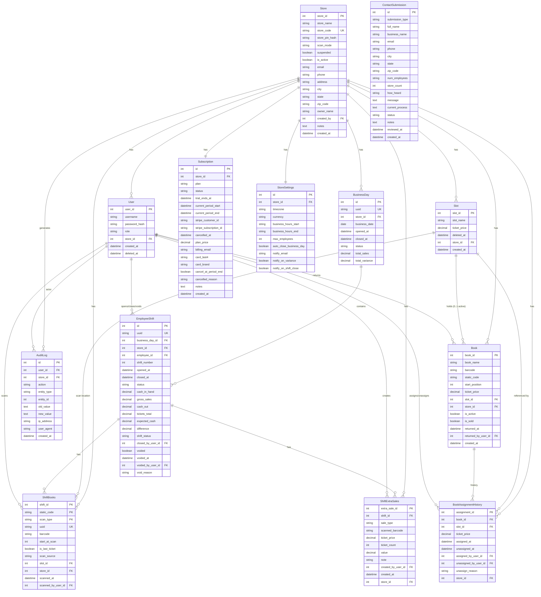

# Entity Relationship Diagram — LottoMeter v2.0

**Version:** 4.0
**Date:** May 2026
**Status:** Current — reflects all models through Phase 4h (subscription system)

---

## Overview

LottoMeter v2.0 uses 13 models. Every non-Store operational table carries `store_id` for multi-tenancy. The Subscription, StoreSettings, AuditLog, and ContactSubmission models were added in Phase 4h to support commercial operations and the superadmin panel.

---

## Diagram



---

## Tables

### 1. Store
Root tenant entity.

| Column | Type | Constraints | Notes |
|---|---|---|---|
| store_id | Integer | PK, autoincrement | |
| store_name | String(150) | Not Null | |
| store_code | String(50) | Unique, Not Null | Human-readable identifier |
| store_pin_hash | String(256) | Nullable | bcrypt hash of 4-digit PIN |
| scan_mode | String(30) | Not Null, default 'camera_single' | `camera_single` \| `camera_continuous` \| `hardware_scanner` |
| suspended | Boolean | Not Null, default False | Set by superadmin to block store access |
| is_active | Boolean | Not Null, default True | Logical active flag |
| email | String(150) | Nullable | Store contact email |
| phone | String(30) | Nullable | Store contact phone |
| address | String(250) | Nullable | Street address |
| city | String(100) | Nullable | |
| state | String(50) | Nullable | |
| zip_code | String(20) | Nullable | |
| owner_name | String(150) | Nullable | Owner / primary contact |
| created_by | Integer | FK → User, Nullable | Superadmin user_id who created this store |
| notes | Text | Nullable | Internal superadmin notes |
| created_at | DateTime | Not Null, default now() | UTC |

### 2. User

| Column | Type | Constraints | Notes |
|---|---|---|---|
| user_id | Integer | PK, autoincrement | |
| username | String(100) | Not Null | |
| password_hash | String(256) | Not Null | bcrypt |
| role | String(50) | Not Null, default 'employee' | `admin` \| `employee` \| `superadmin` |
| store_id | Integer | FK → Store, Not Null, Indexed | |
| created_at | DateTime | Not Null, default now() | |
| deleted_at | DateTime | Nullable | Soft-delete timestamp; null = active |

**Partial unique index:**
```sql
CREATE UNIQUE INDEX uq_users_store_username_active
  ON users (store_id, username)
  WHERE deleted_at IS NULL;
```

**Check:** `role IN ('admin', 'employee', 'superadmin')`

`superadmin` users have cross-store access and are used exclusively for LottoMeter platform staff via the superadmin panel.

### 3. Slot

| Column | Type | Constraints | Notes |
|---|---|---|---|
| slot_id | Integer | PK, autoincrement | |
| slot_name | String(100) | Not Null | |
| ticket_price | Numeric(10,2) | Not Null | Must be in LENGTH_BY_PRICE keys |
| deleted_at | DateTime | Nullable | Soft-delete timestamp |
| store_id | Integer | FK → Store, Not Null, Indexed | |
| created_at | DateTime | Not Null, default now() | |

**Partial unique index:**
```sql
CREATE UNIQUE INDEX uq_slots_store_name_active
  ON slots (store_id, slot_name)
  WHERE deleted_at IS NULL;
```

**Check:** `ticket_price IN (1.00, 2.00, 3.00, 5.00, 10.00, 20.00)`

### 4. Book

| Column | Type | Constraints | Notes |
|---|---|---|---|
| book_id | Integer | PK, autoincrement | |
| book_name | String(150) | Nullable | Optional admin label |
| barcode | String(100) | Not Null | Scanned barcode at most recent assignment |
| static_code | String(100) | Nullable until assignment, Indexed | Barcode minus last 3 digits |
| start_position | Integer | Nullable until assignment | Position at time of assignment |
| ticket_price | Numeric(10,2) | Nullable until assignment | Inherited from slot |
| slot_id | Integer | FK → Slot, Nullable | Null when unassigned or sold/returned |
| store_id | Integer | FK → Store, Not Null, Indexed | |
| is_active | Boolean | Not Null, default False | True when in a slot |
| is_sold | Boolean | Not Null, default False | True when last ticket scanned |
| returned_at | DateTime | Nullable | Set when book returned to vendor |
| returned_by_user_id | Integer | FK → User, Nullable | |
| created_at | DateTime | Not Null, default now() | |

### 5. BookAssignmentHistory

| Column | Type | Constraints | Notes |
|---|---|---|---|
| assignment_id | Integer | PK, autoincrement | |
| book_id | Integer | FK → Book, Not Null, Indexed | |
| slot_id | Integer | FK → Slot, Not Null | |
| ticket_price | Numeric(10,2) | Not Null | Snapshot |
| assigned_at | DateTime | Not Null, default now() | |
| unassigned_at | DateTime | Nullable | |
| assigned_by_user_id | Integer | FK → User, Not Null | |
| unassigned_by_user_id | Integer | FK → User, Nullable | |
| unassign_reason | String(50) | Nullable | `reassigned` \| `unassigned` \| `sold` \| `returned_to_vendor` |
| store_id | Integer | FK → Store, Not Null, Indexed | |

### 6. BusinessDay

One per store per calendar date. Auto-created when the first EmployeeShift of the day opens.

| Column | Type | Constraints | Notes |
|---|---|---|---|
| id | Integer | PK, autoincrement | |
| uuid | String(36) | Unique, Nullable | UUID for offline sync identification |
| store_id | Integer | FK → Store, Not Null, Indexed | |
| business_date | Date | Not Null | Calendar date (local to store) |
| opened_at | DateTime | Not Null, default now() | |
| closed_at | DateTime | Nullable | |
| status | String(20) | Not Null, default 'open' | `open` \| `closed` \| `auto_closed` |
| total_sales | Numeric(10,2) | Nullable | Set at BusinessDay close |
| total_variance | Numeric(10,2) | Nullable | Set at BusinessDay close |

**Unique:** `(store_id, business_date)`

### 7. EmployeeShift

One employee session within a BusinessDay.

| Column | Type | Constraints | Notes |
|---|---|---|---|
| id | Integer | PK, autoincrement | |
| uuid | String(36) | Unique, Nullable | UUID for offline sync identification |
| business_day_id | Integer | FK → BusinessDay, Not Null, Indexed | |
| store_id | Integer | FK → Store, Not Null, Indexed | |
| employee_id | Integer | FK → User, Not Null | |
| shift_number | Integer | Not Null | Sequence within BusinessDay (starts at 1) |
| opened_at | DateTime | Not Null, default now() | |
| closed_at | DateTime | Nullable | |
| status | String(20) | Not Null, default 'open' | `open` \| `closed` |
| cash_in_hand | Numeric(10,2) | Nullable | Entered at close |
| gross_sales | Numeric(10,2) | Nullable | Entered at close |
| cash_out | Numeric(10,2) | Nullable | Entered at close |
| tickets_total | Numeric(10,2) | Nullable | Auto-calculated at close |
| expected_cash | Numeric(10,2) | Nullable | `gross_sales + tickets_total - cash_out` |
| difference | Numeric(10,2) | Nullable | `cash_in_hand - expected_cash` |
| shift_status | String(20) | Nullable | `correct` \| `over` \| `short` |
| closed_by_user_id | Integer | FK → User, Nullable | |
| voided | Boolean | Not Null, default False | |
| voided_at | DateTime | Nullable | |
| voided_by_user_id | Integer | FK → User, Nullable | |
| void_reason | String(500) | Nullable | |

**Partial unique index (one open shift per store):**
```sql
CREATE UNIQUE INDEX uq_one_open_employee_shift_per_store
  ON employee_shifts (store_id)
  WHERE status = 'open' AND voided = FALSE;
```

**Composite unique:** `(business_day_id, shift_number)`

### 8. ShiftBooks

Scan records. The `uuid` column enables the offline sync queue to match mobile-created scans to server records.

| Column | Type | Constraints | Notes |
|---|---|---|---|
| shift_id | Integer | PK, FK → EmployeeShift | |
| static_code | String(100) | PK | Book identifier (barcode minus last 3 digits) |
| scan_type | String(10) | PK | `open` \| `close` |
| uuid | String(36) | Unique, Nullable | UUID for offline sync identification |
| barcode | String(100) | Not Null | Full barcode at scan time (audit) |
| start_at_scan | Integer | Not Null | Position extracted from barcode |
| is_last_ticket | Boolean | Not Null, default False | |
| scan_source | String(25) | Not Null, default 'scanned' | `scanned` \| `carried_forward` \| `whole_book_sale` \| `returned_to_vendor` \| `offline` |
| slot_id | Integer | FK → Slot, Not Null | Slot at scan time (denormalized) |
| store_id | Integer | FK → Store, Not Null, Indexed | |
| scanned_at | DateTime | Not Null, default now() | |
| scanned_by_user_id | Integer | FK → User, Not Null | |

**PK:** Composite `(shift_id, static_code, scan_type)`

### 9. ShiftExtraSales

| Column | Type | Constraints | Notes |
|---|---|---|---|
| extra_sale_id | Integer | PK, autoincrement | |
| shift_id | Integer | FK → EmployeeShift, Not Null, Indexed | |
| sale_type | String(25) | Not Null | `whole_book` |
| scanned_barcode | String(100) | Not Null | Audit |
| ticket_price | Numeric(10,2) | Not Null | |
| ticket_count | Integer | Not Null | |
| value | Numeric(10,2) | Not Null | |
| note | String(500) | Nullable | |
| created_by_user_id | Integer | FK → User, Not Null | |
| created_at | DateTime | Not Null, default now() | |
| store_id | Integer | FK → Store, Not Null, Indexed | |

### 10. Subscription

One row per store. Created automatically (trial) when a store is provisioned by superadmin.

| Column | Type | Constraints | Notes |
|---|---|---|---|
| id | Integer | PK, autoincrement | |
| store_id | Integer | FK → Store, Unique, Not Null | One subscription per store |
| plan | String(20) | Not Null, default 'basic' | `basic` \| `pro` \| `enterprise` |
| status | String(20) | Not Null, default 'trial' | `trial` \| `active` \| `expired` \| `suspended` \| `cancelled` |
| trial_ends_at | DateTime | Nullable | |
| current_period_start | DateTime | Nullable | |
| current_period_end | DateTime | Nullable | |
| stripe_customer_id | String(100) | Nullable | Set when Stripe billing activated |
| stripe_subscription_id | String(100) | Nullable | |
| cancelled_at | DateTime | Nullable | |
| plan_price | Numeric(10,2) | Nullable | Monthly price |
| billing_email | String(150) | Nullable | |
| card_last4 | String(4) | Nullable | |
| card_brand | String(20) | Nullable | |
| cancel_at_period_end | Boolean | Not Null, default False | |
| cancelled_reason | String(250) | Nullable | |
| notes | Text | Nullable | Internal superadmin notes |
| created_at | DateTime | Not Null, default now() | |

**Check:** `status IN ('trial', 'active', 'expired', 'suspended', 'cancelled')`

### 11. StoreSettings

One row per store. Created automatically with defaults when a store is provisioned.

| Column | Type | Constraints | Notes |
|---|---|---|---|
| id | Integer | PK, autoincrement | |
| store_id | Integer | FK → Store, Unique, Not Null | One settings row per store |
| timezone | String(50) | Not Null, default 'America/New_York' | IANA timezone string |
| currency | String(10) | Not Null, default 'USD' | ISO 4217 code |
| business_hours_start | String(5) | Nullable | `HH:MM` format, e.g. `"09:00"` |
| business_hours_end | String(5) | Nullable | `HH:MM` format, e.g. `"23:00"` |
| max_employees | Integer | Not Null, default 10 | |
| auto_close_business_day | Boolean | Not Null, default False | |
| notify_email | String(150) | Nullable | Email for system notifications |
| notify_on_variance | Boolean | Not Null, default True | Alert on short/over shift result |
| notify_on_shift_close | Boolean | Not Null, default False | Alert on every shift close |

### 12. AuditLog

Append-only log of significant admin and superadmin actions. Not store-scoped exclusively — superadmin actions may have `store_id = null`.

| Column | Type | Constraints | Notes |
|---|---|---|---|
| id | Integer | PK, autoincrement | |
| user_id | Integer | FK → User, Nullable | Actor (null for system actions) |
| store_id | Integer | FK → Store, Nullable | Affected store (null for cross-store) |
| action | String(100) | Not Null | e.g. `store_created`, `store_suspended`, `subscription_cancelled` |
| entity_type | String(50) | Nullable | e.g. `store`, `subscription`, `user` |
| entity_id | Integer | Nullable | PK of affected entity |
| old_value | Text | Nullable | JSON or plain string snapshot before change |
| new_value | Text | Nullable | JSON or plain string snapshot after change |
| ip_address | String(50) | Nullable | Request IP |
| user_agent | String(200) | Nullable | Truncated to 200 chars |
| created_at | DateTime | Not Null, default now() | UTC |

**Index:** `(store_id, created_at)` for per-store audit queries

### 13. ContactSubmission

Stores all public-facing form submissions: contact page, apply page, and waitlist signups. Reviewed in the superadmin panel.

| Column | Type | Constraints | Notes |
|---|---|---|---|
| id | Integer | PK, autoincrement | |
| submission_type | String(20) | Not Null, default 'contact' | `contact` \| `apply` \| `waitlist` |
| full_name | String(150) | Not Null | |
| business_name | String(150) | Nullable | |
| email | String(150) | Not Null | |
| phone | String(50) | Nullable | |
| city | String(100) | Nullable | |
| state | String(50) | Nullable | |
| zip_code | String(20) | Nullable | |
| num_employees | String(20) | Nullable | Free-form range, e.g. `"1-5"` |
| store_count | Integer | Nullable | From apply form |
| how_heard | String(50) | Nullable | Referral source |
| message | Text | Nullable | Free-text from contact form |
| current_process | Text | Nullable | From apply form — describes existing workflow |
| status | String(20) | Not Null, default 'new' | `new` \| `reviewed` \| `approved` |
| notes | Text | Nullable | Internal superadmin notes |
| reviewed_at | DateTime | Nullable | Set when status changes from 'new' |
| created_at | DateTime | Not Null, default now() | UTC |

**Check:** `status IN ('new', 'reviewed', 'approved')`
**Check:** `submission_type IN ('contact', 'apply', 'waitlist')`

---

## Relationships

| Parent | Child | Type | On Delete |
|---|---|---|---|
| Store | User | 1 : ∞ | RESTRICT |
| Store | Slot | 1 : ∞ | RESTRICT |
| Store | Book | 1 : ∞ | RESTRICT |
| Store | BookAssignmentHistory | 1 : ∞ | RESTRICT |
| Store | BusinessDay | 1 : ∞ | RESTRICT |
| Store | ShiftBooks | 1 : ∞ | RESTRICT |
| Store | ShiftExtraSales | 1 : ∞ | RESTRICT |
| Store | Subscription | 1 : 1 | RESTRICT |
| Store | StoreSettings | 1 : 1 | RESTRICT |
| Store | AuditLog | 1 : ∞ | SET NULL |
| Slot | Book | 1 : ∞ (0..1 active) | SET NULL |
| Slot | BookAssignmentHistory | 1 : ∞ | RESTRICT |
| Slot | ShiftBooks | 1 : ∞ | RESTRICT |
| Book | BookAssignmentHistory | 1 : ∞ | CASCADE |
| BusinessDay | EmployeeShift | 1 : ∞ | RESTRICT |
| EmployeeShift | ShiftBooks | 1 : ∞ | CASCADE |
| EmployeeShift | ShiftExtraSales | 1 : ∞ | CASCADE |
| User | EmployeeShift (opened_by) | 1 : ∞ | RESTRICT |
| User | EmployeeShift (closed_by) | 1 : ∞ | RESTRICT |
| User | EmployeeShift (voided_by) | 1 : ∞ | RESTRICT |
| User | ShiftBooks (scanned_by) | 1 : ∞ | RESTRICT |
| User | ShiftExtraSales (created_by) | 1 : ∞ | RESTRICT |
| User | BookAssignmentHistory | 1 : ∞ | RESTRICT |
| User | Book (returned_by) | 1 : ∞ | RESTRICT |
| User | AuditLog (actor) | 1 : ∞ | SET NULL |

---

## Business Constants

`LENGTH_BY_PRICE` lives in `app/constants.py`:

```python
from decimal import Decimal

LENGTH_BY_PRICE = {
    Decimal("1.00"):  150,
    Decimal("2.00"):  150,
    Decimal("3.00"):  100,
    Decimal("5.00"):   60,
    Decimal("10.00"):  30,
    Decimal("20.00"):  30,
}
```

---

## Offline Sync UUID Fields

`EmployeeShift.uuid`, `BusinessDay.uuid`, and `ShiftBooks.uuid` are nullable string columns that hold UUID v4 values. They exist to support the offline sync architecture (Phase 5a) where the mobile app creates local records with client-generated UUIDs before network connectivity is restored. The UUID allows the sync queue to match mobile-created records to their eventual server counterparts.

The mobile offline layer generates UUIDs on the device and stores them in local SQLite tables (`local_employee_shifts`, `local_shift_books`). On sync, the server accepts the UUID and stores it in the corresponding column, enabling idempotent upserts.

---

## Schema Decision Log (v4.0 additions)

18. **Store.suspended + is_active added** — `suspended` = superadmin-imposed block (e.g. payment failure); `is_active` = logical soft-disable. Separated because suspension and deactivation have different semantics and different actors (platform vs. internal).
19. **Store contact fields (email, phone, address, etc.)** — needed for superadmin panel store management and for future billing/notification integrations.
20. **Store.created_by FK** — tracks which superadmin provisioned each store; nullable to preserve pre-v4.0 stores.
21. **User.role adds 'superadmin'** — cross-store platform staff require a role separate from per-store admins. Implemented as a third role value to avoid a separate user table.
22. **Subscription table** — one row auto-created per store at provisioning with `status='trial'`. Stripe fields nullable until payment integration (Phase 5b).
23. **StoreSettings table** — one row auto-created per store with defaults. Separates operational preferences from the Store identity record.
24. **AuditLog table** — append-only; no hard deletes. `store_id` nullable so superadmin cross-store actions can be logged without picking an arbitrary store.
25. **ContactSubmission table** — single table for all public form types (`contact`, `apply`, `waitlist`) using a discriminator column to avoid three near-identical tables.
26. **uuid columns on EmployeeShift, BusinessDay, ShiftBooks** — client-generated offline identifiers for the sync queue. Nullable for backward compatibility with records created before offline mode.
27. **scan_source adds 'offline'** — distinguishes scans created by the offline engine from server-side scans; 'offline' source records are synced to the server via the sync queue.
