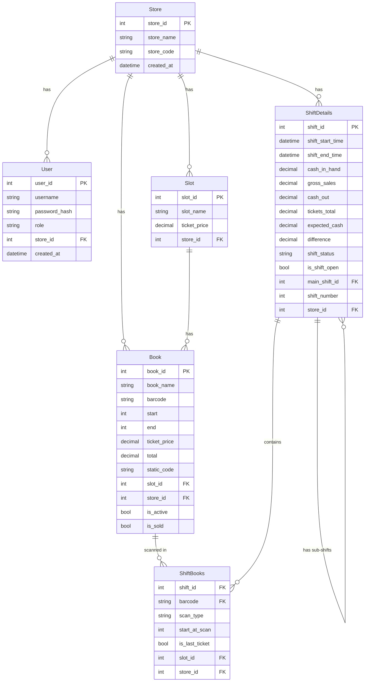

# Entity Relationship Diagram — LottoMeter v2.0

---

> **Last Updated:** April 2026 — reflects final verified business logic

---

## ERD



---

## Model Descriptions

### Store
Root tenant entity. Every piece of data belongs to a store via `store_id`.

### User
Store employees and admins. `role` is `employee` or `admin`. In v2.0 only `employee` is enforced.

### Slot
A physical location in the store that holds lottery books. Has a `ticket_price` that serves as the default price for all books assigned to it.

### Book
A lottery ticket book. Key fields:
- `start` / `end` — physical ticket numbers, used to locate the book and calculate tickets sold
- `ticket_price` — copied from slot at assignment, can be overridden per book, stored permanently for accurate historical reports
- `total` — (end - start) × ticket_price, stored for reports
- `static_code` — extracted from barcode, used for matching during scan
- `is_active` — True when assigned to a slot
- `is_sold` — True when last ticket barcode is scanned during shift

### ShiftDetails
Represents both main shifts and sub-shifts.
- `main_shift_id` = NULL → this is a main shift (container only, no direct scans)
- `main_shift_id` = FK → this is a sub-shift (has scans, manual inputs, and calculated totals)

**Every main shift has at least one sub-shift.** Scanning and closing always happens on sub-shifts.

**Sub-shift closing fields (entered manually by employee):**
- `cash_in_hand` — physical cash at closing
- `gross_sales` — from the register
- `cash_out` — manually entered

**Sub-shift closing fields (calculated automatically):**
- `tickets_total` — sum of sold book values for this sub-shift
- `expected_cash` — gross_sales + tickets_total - cash_out
- `difference` — cash_in_hand - expected_cash
- `shift_status` — `correct` (diff=0), `over` (diff>0), `short` (diff<0)

**Main shift totals** = sum of all sub-shifts. No manual inputs on main shift.

### ShiftBooks
Records every book scan during a shift.
- `scan_type` — `open` (scanned at shift open) or `close` (scanned at shift close)
- `start_at_scan` — book's ticket position at time of scan
- `is_last_ticket` — True when barcode ends in `029`, `149`, `059`, or `099`

---

## Last Ticket Detection — Fixed Suffixes

```python
LAST_TICKET_SUFFIXES = ['029', '149', '059', '099']

def is_last_ticket(barcode):
    return any(barcode.endswith(suffix) for suffix in LAST_TICKET_SUFFIXES)
```

These suffixes are fixed and cannot be configured.

---

## Shift Validation Formula

```
expected_cash = gross_sales + tickets_total - cash_out
difference    = cash_in_hand - expected_cash

difference = 0  → correct
difference > 0  → over  (employee has more cash than expected)
difference < 0  → short (employee has less cash than expected)
```

---

## Ticket Price Breakdown (Every Report)

Calculated at closing for both sub-shifts and main shift:

```python
breakdown = {}
for book in sold_books:
    price = book.ticket_price
    tickets_sold = book.end - book.start
    breakdown[price]["tickets"] += tickets_sold
    breakdown[price]["value"]   += tickets_sold * price
```

---

## SQLAlchemy Model Summary

| Model | Table Name | Primary Key |
|---|---|---|
| Store | stores | store_id |
| User | users | user_id |
| Slot | slots | slot_id |
| Book | books | book_id |
| ShiftDetails | shift_details | shift_id |
| ShiftBooks | shift_books | (shift_id, barcode) — composite |

---

## User Roles

| Role | v2.0 | v2.1+ |
|---|---|---|
| `employee` | ✅ Active | ✅ Active |
| `admin` | ⏳ Column exists, not enforced | ✅ Active |

---

*Phase 3 — System Design | LottoMeter v2.0*
